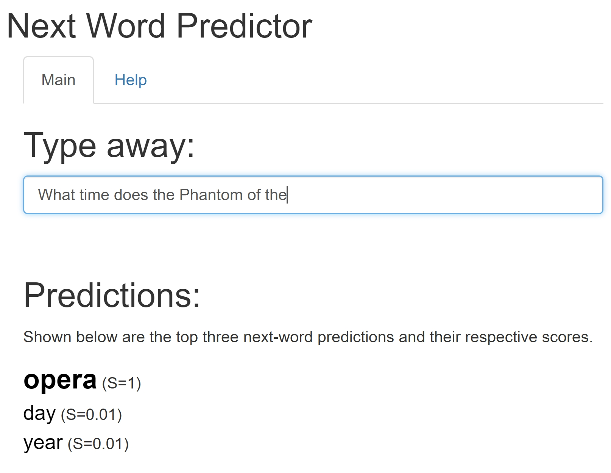

Next-word Predictor
========================================================
author: Steve Bachmeier
date: 2018-10-23
transition: linear
autosize: true

https://stevebachmeier.shinyapps.io/nextWordPredictor/

Background
========================================================
~~Natural language processing (NLP) is a challenging field that has many applications, including relevant text extraction, sentiment analysis, etc. The application presented here provides a solution to another related problem: next-word prediction.~~

~~Predicting the next word to a user's text input can be useful in many ways. Examples include decreasing the search time when using a web browser or increasing text accuracy/speed on a phone.~~

~~The app can be found online at https://stevebachmeier.shinyapps.io/nextWordPredictor/.~~

Approach
========================================================
NLP of any type is difficult for a variety of reasons, including (but not limited to) how do deal with: mis-spelled words and/or foreign words, sentiment, special characters, and commonly used words that may or may not matter to the problem at hand (called 'stopwords').

While there are many ways to build up a next-word predictor algorithm, we've chosen to use the so-called Stupid Backoff method. We started by combining and randomly sampling three text corpora - one of tweets, one of blogs, and one of news articles - generously provided by Swiftkey and cleaning/processing the text. Then we tokenized it and created data sets of 4-grams, trigrams, bigrams, and unigrams.

***

Steps:

1. Sample text corpora.

2. Clean data set.

3. Tokenize.

4. Create n-gram sets.

5. Apply Stupid Backoff.
    + Check 4-grams set for trigrams plus prediction. Score.
    + Check trigrams set for bigrams plus prediction. Score with knockdown factor.
    + Check bigrams set for unigrams plus prediction. Score with (knockdown factor)^2.
    + Check unigrams set for top predictions. Score with (knockdown factor)^3.

6. Add each prediction's score from each of the backoffs.

7. Offer the three predictions with the highest scores.

Example
========================================================

A user is going to see the play The Phantom of the Opera with a friend and texts her asking what time it starts:

***

Steps:

1. Strip trigram from end of the user input: "phantom of the".

2. Search 4-grams data set for "phantom of the \<prediction\>." Score all predictions.

3. Search the trigrams data set for "of the \<prediction\>." Score all predictions with backoff factor 0.4.

4. Search the bigrams data set for "the \<prediction\>." Score all predictions with backoff factor 0.4^2.

5. Score unigrams data set with backoff factor 0.4^3.

6. Add up each prediction's score and return the top three.

Note that the score of a given prediction is the probability of that prediction showing up in a given n-grams set multiplied by the appropriate backoff factor (in this case, 0.4^k, where k is the current backoff step).

Performance
========================================================
It's very important that the app is both accurate as well as fast. As a comparison, SwiftKey's next-word prediction accuracy is often mentioned as being ~30%; we would like at least 10% accuracy to start for this app. As for speed, it qualitatively must be fast enough to be usable as an app hosted on shinyapps.io with the free subscription.

Using a benchmark tool that another student developed - which runs through 599 blogs and 793 tweets - we show (at right) the accuracy, speed, and memory used when run on a laptop with an 8th generation Intel i7 processor and 16gb of RAM.

We see that with a top-1 precision of 14.1%, an average runtime of 218ms, and a total memory of only 74.8MB, we are well within our desired goals.

***

Overall top-3 score:     18.46 %  
Overall top-1 precision: 14.09 %  
Overall top-3 precision: 22.28 %  
Average runtime:         218.17 msec  
Number of predictions:   28464  
Total memory used:       74.79 MB  

Dataset "blogs" (599 lines, 14587 words)  
Score: 17.11 %, Top-1 precision: 12.64 %, Top-3 precision: 21.12 %

Dataset "tweets" (793 lines, 14071 words)  
Score: 19.81 %, Top-1 precision: 15.53 %, Top-3 precision: 23.44 %

Suggestions
========================================================
There are two types of improvement we can make: speed and accuracy. Some suggestions for follow-up testing include:

Speed:
* Index the n-grams data sets.
* Sample less data (at the expense of accuracy).*

Accuracy:
* Sample more data (at the expense of speed).*
* Increase n-grams search (at the expense of speed).*
* Remove predictions found from lower n-gram searches.

\* Benchmark testing showed that sampling 10% of the SwiftKey data and keeping up to 4-gram data sets provided a good balance between speed and accuracy.

~~Thanks!~~
